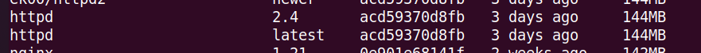
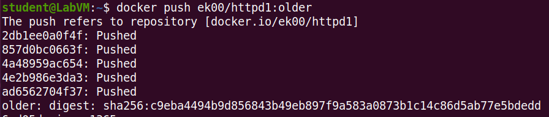
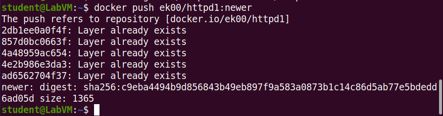

 <h1>Sprawozdanie z laboratorium 13B - zadanie 13.1</h1> 
 
 Pobrane obrazy to Httpd Apache w dwóch różnych wersjach:
 
 Wypchnięcie obrazów pod inną nazwą do swojego repozytorium DockerHub:
  
  
  

