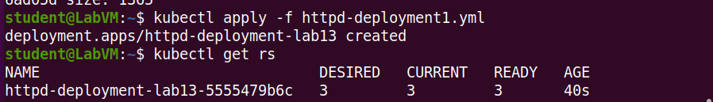
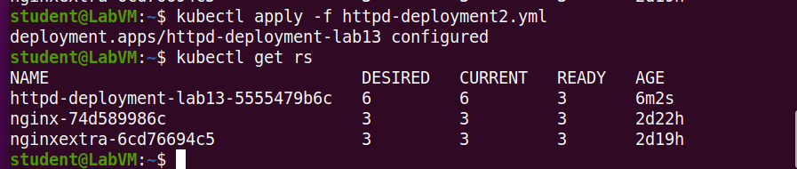
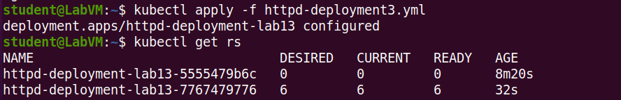
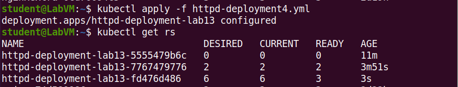
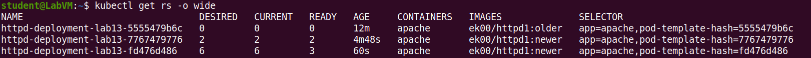
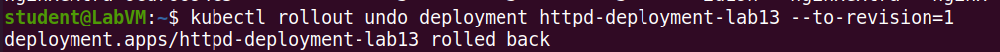
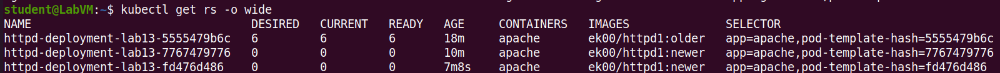

 <h1>Sprawozdanie z laboratorium 13B - zadanie 13.1</h1> 
 
 Pobrane obrazy to Httpd Apache w dwóch różnych wersjach:
  
 Wypchnięcie obrazów pod inną nazwą do swojego repozytorium DockerHub:
  
   
  Uruchomiony obiekt z 3 podami w pierwszej wersji (httpd-deployment1.yml) 
     
  Aplikacja przeskalowana do pracy na 6 podach (httpd-deployment2.yml) 
   
  Aplikacja zaktualizowana do nowej wersji, nadal na 6 podach (httpd-deployment3.yml) 
     
  Aplikacji zostały przydzielone nowe zasoby (httpd-deployment4.yml) 
    
    
   Downgrade aplikacji do 1 wersji: 
    
    

